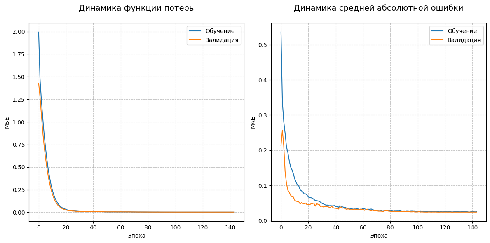

# Прогнозирование результатов политических выборов с использованием нейронной сети

  


## Описание проекта
Модель машинного обучения для предсказания доли голосов кандидатов на выборах. Реализована на TensorFlow/Keras с использованием данных о выборах в США (2016 г.). 

**Ключевые особенности**:
- Обработка категориальных и числовых признаков через `ColumnTransformer`
- Регуляризация (L2, Dropout, BatchNorm) для борьбы с переобучением
- Визуализация процесса обучения и предсказаний
- Автоматическая остановка при переобучении (`EarlyStopping`)

## 📊 Результаты
| Метрика               | Значение       |
|-----------------------|----------------|
| Тестовая MAE          | 2.53%          |
| Тестовая MSE          | 0.0029         |
| Средняя ошибка        | 2.5 п.п.       |
| 95% предсказаний      | ±11.3 п.п.     |

## 🛠 Установка
1. Клонировать репозиторий:
   ```bash
   git clone https://github.com/TwoRulonOboev/Machine_learning_of_python.git
   ```
2. Установить зависимости:
   ```bash
   pip install -r requirements.txt
   ```
   (Файл `requirements.txt` должен включать: `tensorflow`, `pandas`, `scikit-learn`, `matplotlib`)

## 🚀 Использование
1. Загрузите [датасет с Kaggle](https://www.kaggle.com/datasets/benhamner/2016-us-election)
2. Поместите файл `election_data.csv` в папку `data/`
3. Запустите ноутбук:


## 🧠 Архитектура модели
```python
model = Sequential([
    Dense(128, activation='relu', input_shape=(input_shape,)),
    BatchNormalization(),
    Dropout(0.5),
    Dense(64, activation='relu'),
    BatchNormalization(),
    Dropout(0.3),
    Dense(32, activation='relu'),
    Dense(1)
])
```

## 📁 Структура данных
```bash
.
├── 1976-2020-president.csv     # Исходные данные
├── res/                        # Графики и изображения
├── jupiter.ipynb               # Основной код
└── README.md
```

## 📈 Визуализации
1. **Динамика обучения**:  
   - Снижение MSE и MAE на тренировочных и валидационных данных
   - Ранняя остановка на эпохе 139

2. **Точность предсказаний**:  
   - Точечная диаграмма с линией идеального предсказания
   - Цветовая кодировка ошибок

## Лицензия
[MIT](https://choosealicense.com/licenses/mit/)

```

Этот шаблон:
1. Использует понятную визуальную иерархию
2. Включает скриншоты из папки `res`
3. Содержит все ключевые метрики
4. Дает четкие инструкции по запуску
5. Подходит для размещения на GitHub/GitLab